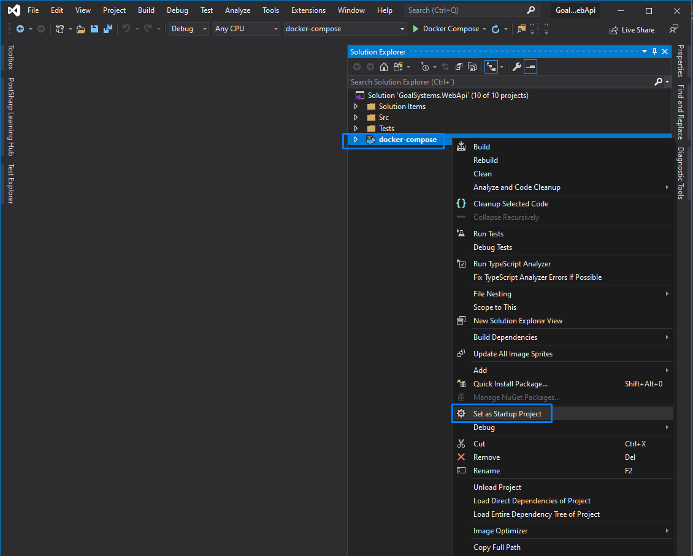

# Arquitectura Gestor de inventario

## Dependencias

- Docker (docker-compose)
- Visual Studio 2019

## Instrucciones

1. Clonar la solución desde el [repositorio](http://example.com).
2. Abrir la solución con Visual Studio 2019
3. Seleccionar el proyecto virtual docker-compose como Start up project
4. Ejecutar en modo release (ctrl+F5)
5. La Web API estará publicada en un contenedor. Desde el browser puede accederse a la interfaz Swagger en http://localhost:3340 o https://localhost:3341 (se redireccionará directamente al puerto mapeado automáticamente por el orquestador) Nota: Si hubiera algún problema, revisar el mapping de puertos con el comando:

```cmd
> docker ps
```



## Arquitectura

Aplicación Rest API con un diseño interno de la solución aplicando arquitectura clásica SOA.
Se pueden distinguir 3 capas horizontales de servicio y una vertical de infraestructura:

1. **Acceso a datos**, usando Entity Framework.

   - Proyecto: Goalsystems.WebApi.Data ( Proyecto .Net Standard 2.0)
   - Models: Contiene las clases POCO que representan las entidades del ORM (**Atajo**: por el momento no se han añadido constructores para la creación de objetos válidos. Al usar Automapper hay que tener en cuenta que debe existir al menos un constructor implícito.)
   - DatabaseContext: Contexto para acceder al sistema de persistencia
   - Infrastructure: Métodos agnósticos a la capa de acceso y métodos de extensión para registrar el Contexto usando Microsoft Sql Servier como tecnología para la persistencia. Si la tecnología de persistencia cambiara en el futuro se podría implementar nuevos métodos de extensión para escoger cual usar. Otra ventaja es que no te obliga a referenciar directamente el DbContext en la capa MVC, con lo cual, se puede prohibir la utilización y creación de esta clase en capas que no sean la inmediatamente superior. Estos métodos serán utilizados en la capa superior, Business.
  
2. **Capa de negocio**, donde se encuentra toda la lógica de negocio.

   - Proyecto: GoalSystems.WebApi.Business (Proyecto .Net Standard 2.0)
   - Models: Contiene las clases de negocio. Si hubiera alguna regla que se pudiera resolver en las mismas no habría ningún problema. Por ejemplo, métodos o propiedades que autocalculen valores. Con los requisitos actuales no ha sido necesario más que controlar que los objetos son correctamente construidos por sus constructores.
   - Services: Todo lo que tiene que ver con los distintos servicios de negocio (en este caso solo existe uno). Aquí residen la interfaz, implementación, notificaciones y excepciones relacionadas con el servio encargado de gestionar la lógica sobre elementos del inventario.
   - Models: Modelos de la capa de negocio. Estas clases deben cumplir el concepto de *Ubiquitous Language*, pues deben representar conceptos existentes en el lenguaje de negocio. Además, si por coherencia pudieran realizar operaciones y efectuar eventos, tampoco estaría mal que se desarrollaran los métodos en esta clase mediante métodos y eventos.
   - Mappers: Se ha usado Automapper como herramienta para mapear modelos de la capa de acceso a datos con la capa de negocio. La capa de negocio jamás debe exponer clases de una capa inferior a una superior.
   - EventHandlers: Controladores de eventos. Todas las acciones del servicio terminan publicando una notificación interna usando el patrón Mediator. Los EventHandlers son, por así decirlo, los suscriptores a esos eventos y realizar las acciones oportunas. El registro se realiza automáticamente por el hecho de implementar la interfaz INotification, en el ensablado de entrada se buscan todos los handlers y para suscribirlos. Ejemplos de qué podrían hacer estos handlers: Publicar un evento en un Bus o cola. De esta forma, el servicio realiza las acciones de las cuales tiene contexto, como persistir datos, notifica de lo que ha hecho, y delega hacia componentes externos cualquier otra acción. Nota: Hay que tener en cuenta que, si la aplicación se cae justo después de la instrucción de persistencia y antes la notificación, el sistema podría quedar en un estado inconsistente. Esta situación es comúnmente conocida con 2PC (two phase commit), es decir, no es una transacción atómica. Para solventar esta situación, se necesitaría implementar un sistema de transaccionabilidad entre eventos. Algunos ejemplos podrían ser aumentando la resiliencia persistiendo en base de datos el estado de cada operación como parte de la "Unit of Work", de tal forma que posteriormente, tras una caída o redespliegue de la aplicación, podría consultarse si existen algún proceso que no ha notificado correctamente y procesarlo.
   - Infrastructure: Al igual que en la capa de acceso a datos, provee métodos agnósticos al negocio y de extensión para la inyección de dependencias. Aquí se registran los servicios necesarios usando los métodos de infraestructura de la capa Data además de los servicios usados en Business. Estos métodos de inyección serán utilizados en la capa superior Front.
  
3. **Capa Front**.

   En este caso utilizando el patrón Modelo Vista Controlador.

   Perfectamente se podría haber implementado en un solo proyecto de tipo Host, sin embargo, he preferido dividirlo en dos proyectos, uno con el todo el código MVC y otro "dummy" (el host) que referenciaría al anterior. Si fuera necesario crear un NuGet package y reutilizarlo con distintos proyectos Hosts, el código de los controladores, configuraciones, etc. sería privado y se podría ofrecer como una solución completa sin exponer detalles de implementación. Ejemplos de otras herramientas que hacen esto son HangFire, IdentityServer, Swagger...

   - Proyecto: GoalSystems.WebApi.Mvc. (Proyecto .Net Core 3.1)
   - Controllers: Los controladores que representan cada recurso de la API Rest.
   - Infrastructure: De nuevo, métodos de utilidad y extensiones para segregar la responsabilidad de la configuración en distintos métodos más manejables, incluido los resgistros de servicios de la capa que utiliza, Business. También contiene global filters de mvc, puede contener serializers, custom binders, etc. Una clase importante es BaseStartup, una clase abstracta donde se registran todos los servicios necesarios para la aplicación, y todos los middlewares. Esta clase se puede heredar en para usarla como Startup en el proyecto Host y en los proyectos de test funcionales. De esta forma al realizar los tests se utilizará la misma configuración que en la aplicación, y ésta se testeará de forma implícita. (**Atajo** Muchos de estos métodos de extensión podrían también estar en un ensamblado genérico para configurar servicios web de .Net Core, siempre y cuando la extensibilidad de la función que realicen no quede comprometida)
   - Mappers: Perfiles con los mapeos para convertir objetos de la capa de negocio a modelos de la Api pública.
   - Models: Los modelos de la capa front se han diseñado para poder extenderse e implementar estándares de comunicación conocidos. En este proyecto se ha usado Json-Api, si bien solo se han tenido en cuenta las propiedades más básicas y necesarias (la propiedad "Data"), sin entrar en complejidades como la propiedad "Link" para implementar HATEOAS. Más información en [json:api](https://jsonapi.org/). El patrón que se ha seguido para los modelos de la API es el de Request/Response, que determina que toda acción debe recibir un Request y devolver un Response. Este patrón es bien conocido en APIs como la de Amazon Web Services. Una de las ventajas es que, para apis más complejas, el desarrollador no tiene que pensar en nombres para los modelos de esta capa, simplemente seguir el convenio "{ActionName}Request" y "{ActionName}Response". Toda acción debe tener su propio Request y Response intentando prevenir la reutilización, ya que en este caso podría haber confusiones e introducir breacking changes por despiste. También tiene sus inconvenientes, la deserialización y mapeo hacia la capa de negocio suelen ser algo más complejas, y en apis basadas en ofrecer verbos CRUD para cada recurso podría desconcertar a los usuarios en algunos casos como el verbo Delete, que usualmente devuelve 204, o Create, que en mucho casos no devuelve más que un Location header para notificar dónde se ha creado el nuevo recurso. Por último, el proyecto GoalSystems.WebApi.Host simplemente referencia al proyecto Mvc, levanta el servidor web y hereda la clase Startup de BaseStartup.

4. Infrastructure: Servicios y clases de proposito general o elementos necesarios en todas o varias capas. En este proyecto conviven dos servicios: BackgroundWorkerService y MediatorService. Además aquí puede encontrarse la clase ConfigurationApp concebida para deserializar el archivo de configuración appsettings.json.
   - BackgroundWorkerService: La interfaz del servicio solo expone un método, el único que es necesario para los requerimientos. En este caso se ha utilizado la herramienta HangFire para trabajar con procesos en background y procesos planificados necesarios para el evento de Fecha de Expiración. También expone un método de extensión para inyectar todas las dependencias. En el futuro, si hiciera falta utilizar otra herramienta distinta bastaría con crear una nueva implementación y un nuevo método para inyectarlo.
   - MediatorService: Un servicio para utilizar el patrón Mediator, la implementación se ha realizado  utilizando la herramienta MediatR, aunque había otras opciones, como MicroBus. Sigue la misma estructura de código que BackgroundWorkerService, con sus métodos de extensión y posibles distintas implementaciones.

## Tests

Cada capa debería tener un proyecto por cada tipo de test que se deban aplicar: Unit, Integration, Functional, Performance, etc... Solo se han creado unos cuantos, por ejemplo.

_GoalSystems.WebApi.Mvc.Tests.Unit_ solo realiza una comprobación para ver si los mappers están correctamente configurados. Aquí deberían ir otros tests para comprobar que todos los servicios inyectados son los correctos, el patrón IOption para acceder a la configuración, y especialmente métodos que impliquen una complejidad algorítmica más alta. Otra opción es añadir las pruebas de las acciones de los controladores mockeando con herramientas como Moq.Net sus servicios y comprobando que se devuelven los códigos y resultados correctos. Sin embargo, personalmente en este caso pienso que los tests funcionales aportan mucho más valor para testear una API, y teniendo herramientas para el Continuous Integration que nos permiten levantar contenedores para la persistencia, simuladores de storage, servidores ftp, buses e incluso clusteres spark. Un buen set de test funcionales probando la misma API usando TestServer de .Net nos daría una gran cobertura, más valor y menos código que mantener (ya que los test unitarios no serían necesarios de realizar en muchos casos).

_GoalSystems.WebApi.Mvc.Tests.Functional_, usando xUnit, FluentAssertions y TestServer, aquí crearía varios tests y theories por cada endpoint comprobando que los códigos de estado HTTP son los correctos, el resultado de la petición así como headers y otros metadatos. También es un buen lugar para consultar el estado de la persistencia usando los servicios y comprobar que todo está como debe estar.

Otro proyecto que no he desarrollado sería el de las pruebas de integración de la capa Business, aunque también podrían ser test unitarios. De nuevo, teniendo la facilidad de usar contenedores, las pruebas de integración suelen ser más rápidos de programar ya que solo hay que mockear servicios que no puedas resolver con contenedores. Las unitarias, por el contrario, deben ser totalmente aisladas y por tanto implican mockear todas las dependencias. En estos casos es cuestión de buscar un consenso, un punto intermedio entre mantenibilidad del código y velocidad. Si se está testeando un repositorio que hace un CRUD a base de datos, el hecho de no tener que mockear las herramientas encargadas de persistir (ADO.Net, EF, SDK de una NoSQL, etc.) nos da un plus en velocidad de desarrollo de prueba, y el tiempo que tardan en pasar usando containers con los recursos de la misma máquina suele ser despreciable.

**Las pruebas que faltarían a nivel funcional son:**

- Verbo DELETE
  - Devolver 200 con el item borrado
  - Devolver 404 si el parámetro de entrada no es encontrado en la base de datos
  - Devolver un 400 si el parámetro de entrada es inválido (null, cadena vacía o mayor que 100 chars)

- Verbo GET
  - Devolver 200 con el item borrado
  - Devolver 404 si el parámetro de entrada no es encontrado en la base de datos
  - Devolver un 400 si el parámetro de entrada es inválido (null, cadena vacía o mayor que 100 chars)

- Verbo PUT
  - Devolver 400 si los parámetros de entrada no son válidos.

**Pruebas unitarias para la capa de infraestructura**

- BackgroundWorkerService
  - Comprobar que el schedule funciona correctamente
  - Comprobar que lanza Argument exceptions si no se llama con los parámetros correctos al método.
  - A tener en cuenta: Mockear la librería Hangfire interna para emular el comportamiento con Moq.Net.
- MediatorService => pruebas similares a las de Hangfire

**Pruebas de integración de ItemServce**
Aunque prácticamente toda la casuística está probada con las de integración, se podría probar las llamadas a los distintos métodos del servicio y realizar los Asserts correspondientes haciendo la consulta a base de datos directamente con EF para comprobar que la persistencia esté como se supone que debe estar.

## Atajos

### Entity Framework en servicios de Business

**No se han implementado repositorios** como wrappers the EF por dos motivos. 

1. Primero, por tiempo. Implementar un repositorio es otra capa más para abstraer la herramienta de acceso a datos utilizada.
2. Segundo, una solución con gran complejidad añade costes de mantenimiento por tener más capas de abstracción. Entity Framework, por definición, no es solo un ORM, sino también una implementación de Repository Pattern y Unit of Work. En otras palabras, los DbSets del contexto son los repositorios, y el SaveChanges es el "Unit of Work" (simplificando bastante la explicación). Hoy en día es muy confuso la palabra ORM porque, por lógica, se aplica a modelos de datos relacionales. Sin embargo, si no pensáramos en EF como un ORM, si no solo como Patrón repositorio y Unit of Work, nos daríamos cuenta que podemos implementar a mano cualquier proveedor. Esto significaría implementar las funciones que evalúan el árbol de expresión generado por linq cuando sea requerido (SaveChanges, SingleAsync, ToList, etc). Un caso curioso es que actualmente existen prácticamente todos los proveedores imaginables compatibles con EF y Linq, donde se incluyen todas las bases de datos documentales famosas, sistemas de persistencia como Box, GDrive, Apis externas como MailChimp, etc.… todo eso usando EF y Linq (no como ORM ni constructor de queries, obviamente, pero sí como capa de abstracción entre servicios externos y el propio sistema). Más datos en [CDATA](https://www.cdata.com/drivers/).

### Migraciones

Cada vez que la aplicación se levanta con docker-compose, se regenera la base de datos. Esto simula el comportamiento de LocalDb, un comportamiento típico para desarrollar y partir siempre desde el mismo estado. No he generado la migración inicial porque no es necesaria ya que siempre se recrea la base de datos en el proyecto Data. Para hacerlo sería lanzando el comando:

```Cmd
 dotnet ef migrations add Initial <parámetros para definir dónde quieres los modelos y el contexto>.
```

Esto es necesario cambiarlo para utilizar migraciones. Aunque lo he gestionado desde código, lo suyo es crear la base de datos o aplicar migraciones en el proceso de deploy cuando el resto de los recursos se hayan desplegado correctamente. Si algo fuera mal, los métodos Down de las migraciones se ejecutarían para dejar la persistencia en el estado anterior.

En el caso de las pruebas de integración, se aplicarían por código tal y como está desarrollado. En el método startup de la prueba (Fixture en caso de xUnit), se debería destruir la base de datos si existiera, generarla y aplicar las migraciones.

### Handlers del patrón Mediator

Como no había especificaciones, simplemente he puesto comentarios en lo que haría el mediador. Según el enunciado se habla de publicar eventos. Si nos refiriéramos a eventos de programación distribuida para comunicar distintos artefactos software independientes, lo suyo sería utilizar un Bus como Azure ServiceBus o AWS SNS.

### InMemory

Aunque empecé utilizando una base de datos InMemory, finalmente decidí utilizar la solución integrada con Visual Studio para generar una solución multi-container. La base de datos se despliega junto con la WebApi. Sin embargo, hay otros servicios que trabajan en memoria pero es importante saber las implicaciones.

- **Hangfire**: si no se persiste y la aplicación para, los trabajos planificados como los de la fecha de expiración, o cualquier trabajo en background que no haya finalizado, se perderían. Lo suyo sería montar un contenedor más con una base de datos (**Redis**, **MongoDB**, **SQL**, etc.) para guardar el estado de los procesos HangFire. Utilizando la ruta relativa "/Hangfire" debería poderse acceder al dashboard de prcesos en background.
- **Mediator**: Lo mismo, una posible solución para prevenir los problemas del 2PC sería persistir en la primera transacción el estado de la publicación junto con el objeto (¿se ha publicado o no?). también cabría la posibilidad de guardar este estado si la persistencia se realizara usando EventSourcing, guardando en un parámetro extra de cada estado o cambio del agregado si se ha publicado el evento correspondiente o no.

## Problemas conocidos o por mejorar

Algunos problemillas que he encontrado por el camino, pero que no he resuelto porque no eran críticos.

### Docker-Compose

Idealmente lo suyo sería poder llamar al comando docker-compose up -d para probar la aplicación sin necesidad de Visual Studio. Sin embargo, por la forma en la que VS autogenera el DockerFile parece no funcionar exactamente igual y se queja al realizar la build del proyecto Mvc.

### Dependencia con MediatR

Uno de los objetivos de crear una abstracción sobre las herramientas para aplicar el patrón mediador era no depender de nada sobre la herramienta. Al final no he tenido tiempo de aislarlo correctamente y como workarround he heredado IMessage directamente de MedatR.INotification. Si no, la herramienta provoca un error en tiempo de ejecución debido a que el mensaje no implementa su interfaz. Esto me hace pensar que hubiera sido mejor opción utilizar MicroBus, que no te obliga a implementar ninguna interfaz. ¿Por qué he usado MediatR? Porque no lo había utilizado antes y era una ocasión perfecta para ver qué podía aportar y que handicaps tiene.

### Pruebas unitarias, de integración, funcionales, performance, etc.

No he dedicado demasiado tiempo a crear pruebas dado que con Swagger pueden realizarse pruebas de humo fácilmente. Especialmente con esta casuística tan sencilla.

La estructura para la prueba que considero ideal es crear proyectos de cada tipo de pruebas por separado y para cada capa.
El motivo de hacerlo así es porque puede disminuir bastante los tiempos de CI.
Primero haríamos un dotnet vstest de los proyectos unitarios ya que son los más rápidos y si alguno falla, no hay que perder el tiempo con el resto.
Después los de integración, y finalmente funcionales.
Las pruebas de performance para mi gusto irían al final ya que según lo concienzudos que sean pueden generar bastante overtime.

No obstante, utilizando el paralelismo de las herramientas de CI/CD que existen en el mercado, se pueden lanzar cada prueba en distintos "Stages".
Por ejemplo, DevOps Pipelines tiene el sistema de multistage pipelines, que te permite paralelizar todo lo que necesites e ir arañando minutos al proceso construir los artefactos.

Otro tipo de prueba, como los de smoke ya necesitarían que el artefacto esté desplegado, por lo que no los tendré en cuenta.

Otro punto importante a tener en cuenta es que, aunque xUnit está pensado para realizar pruebas en paralelo, en el caso de las pruebas funcionales, se necesitan servicios externos como el contenedor SQL. Si el BackgroundWorker y Mediator estuvieran usando persistencia, también otros contenedores serían necesarios para comprobar como se integran todos los componentes. Por este motivo, se ha decidido no paralelizar las pruebas dado que a medida que se añadan más endpoints podría dar lugar a conflictos (se usa la misma base de datos en todas). Se podrían paralelizar creando una base de datos para cada prueba o un container de SQL, pero el proceso sería mucho más costoso en tiempo.

La decisión final ha sido utilizar Respawn para lanzar una señal de reseteo de base de datos (trunca todas las tablas que le digas). Así, aunque las pruebas se realizan síncronamente, se gana en rapidez y aislamiento con cada ejeccución ya que el coste de truncar las tablas con repecto al de crear la base de datos entera y aplicar migraciones es muy superior.

### Tipo de elemento

La propiedad de tipo de elemento se ha diseñado como tipo byte. Estos tipos suelen ser bastante estático así que en estos casos lo suyo es crear un enumerado. Una opción es crear uno solo en la capa de infraestructura para ser reutilizado. Si cada elemento en base de datos tuviera alguna constraint, como ser una foreign key de otra tabla,por ejemplo, lo separaría en dos enumerados para no exponer Ids de persistencia hacia el exterior, uno para la entidad de EF y otro para el resto de la aplicación. El cambio de valores habría que tratarlo en los mappers de la capa Business hacia la capa Data.

### Comentarios

No he añadido la mayoría de los comentarios para documentar las clases y miembros públicos. Es especialmente importante documentar los controladores, acciones y sus modelos, ya que herramientas que usan OpenApi specs pueden gestionar todo desde el código y así el desarrollador no necesita estar yendo a distintas fuentes para documentar o codificar.

### Otras arquitecturas

Otra opción que podría aplicar sería aplicar EventSourcing y CQRS, donde cualquier interacción con el sistema es o una Query, un Command o un Event. EventSourcing nos permitiría también saber un histórico completo de los estados por los que ha pasado cada agregado, además de poder crear snapshots periodicos según las necesidades del sistema. Esta forma de guardar los datos es más robusta cuando el futuro de los datos guardados es incierto. Nos permitiría, por ejemplo, recurrir a todos los históricos y crear reportes, entrenar modelos de ML, etc.

### CI/CD

No he creado las definiciones de CI y CD. No obstante, el orden de ambos procesos sería el siguiente:

**Continuous Integration:**

1. Obtener e instalar dependencias para el Agent donde se esté ejecutando el proceso de CI
2. Restaurar paquetes y realizar la build de cada proyecto implicado en el artefacto.
3. Ejecutar las pruebas en el orden definido previamente.
4. Llamar a otras herramientas como: Generar artefacto de documentación html, markdown..., auditorias como SonarCloud, etc.
5. Si hubiera que realizar NuGet packages, se lanaría la instrucción dotnet pack para la versión de prerelease (yo prefiero generar de paso la de release también en este caso, por si se pasara a producción posteriormente).
6. Publicar el artefacto y lanzar el Deploy

**Continuous Deployment:**

1. Obtener e instalar dependencias para el Agent donde se esté ejecutando el proceso de DI
2. Obtener los binarios previamente generados.
3. Publicar todos los recursos en los servicios utilizados
   - WebApi en un AppService / Azure Function / AKS / ACI...
   - Documentación en un BlobStorage + CDN, o en una Wiki como DevOps
   - Publish de los paquetes NuGet según el entorno. Si estamos en Dev publicariamos las versiones prerelease. Si estamos en Prod las versiones Release (Lo mismo con cualquier otro entorno)
4. Publicar resultados del proceso, documentos de auditoría, etc.